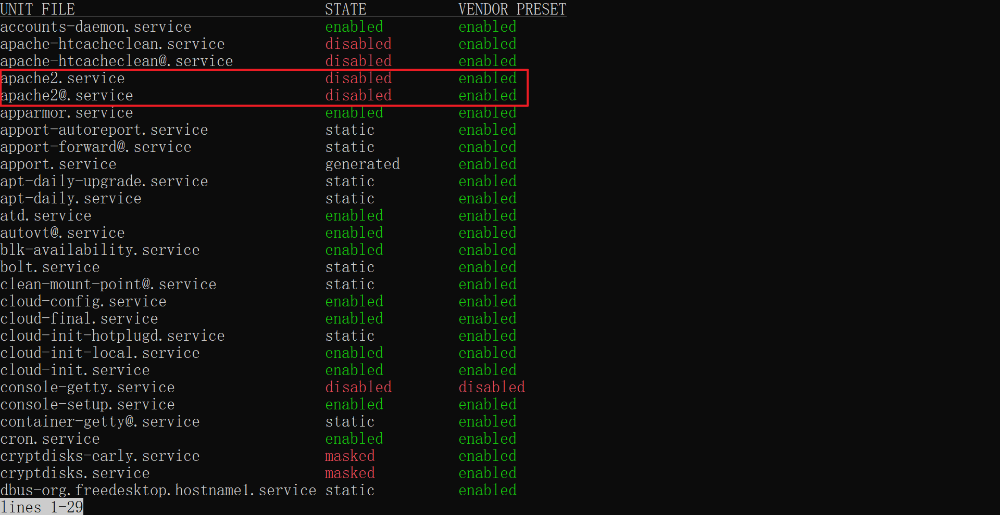
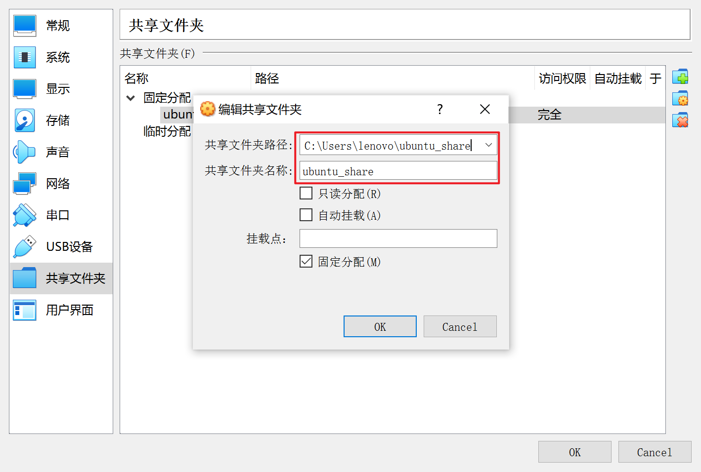
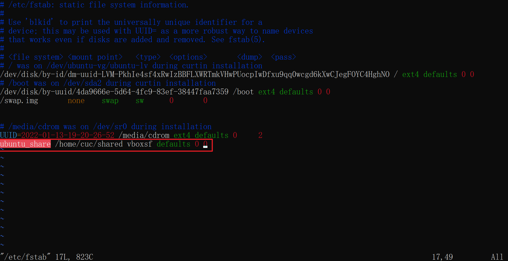
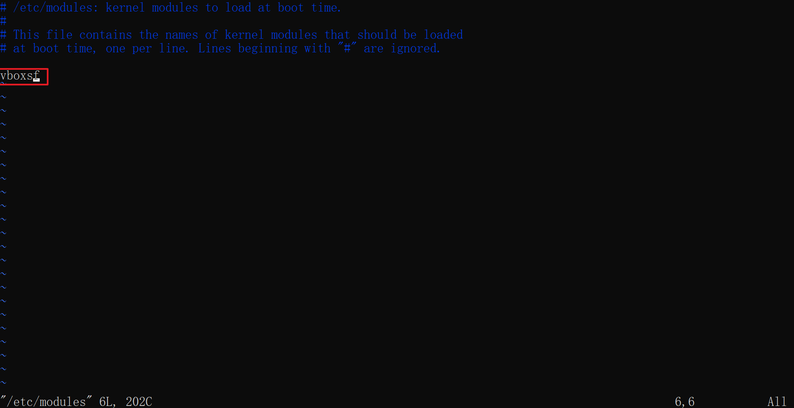
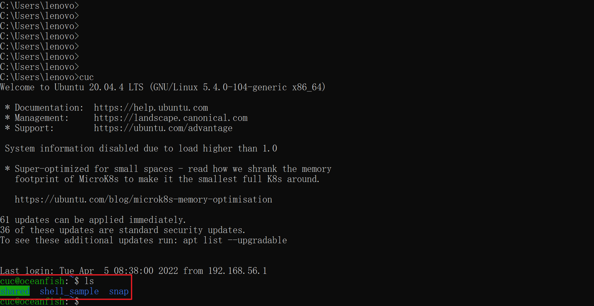
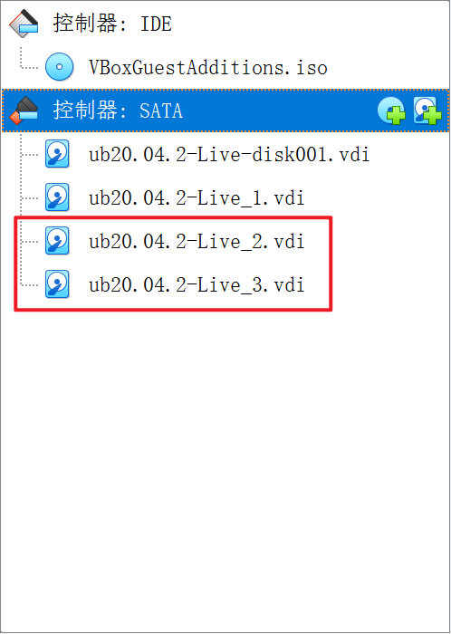
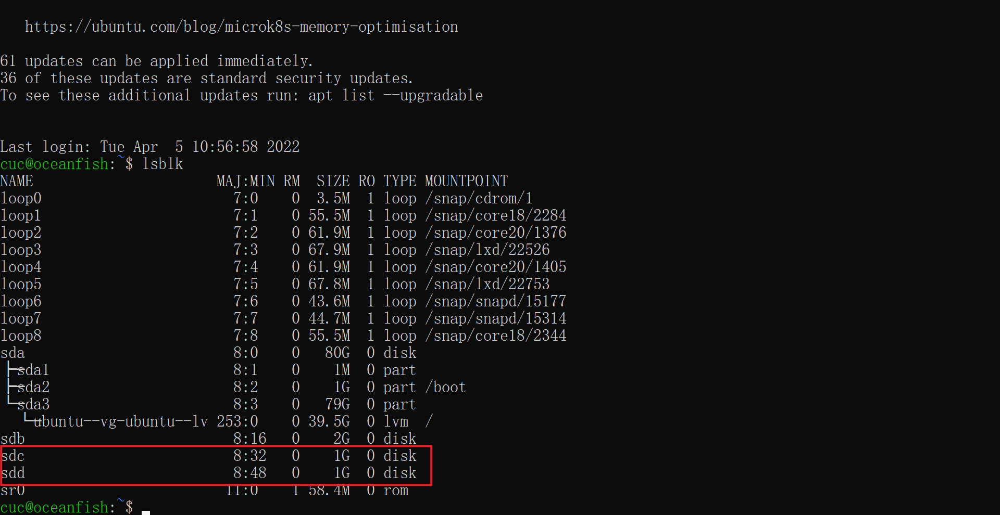

# Linux - H3
> author: OceanFish

---

## 题目

1. 完成<strong> `Systemd` 入门教程练习</strong>并将完整操作过程上传 asciinema， 文档上传 GitHub

2. 完成<strong>自查清单</strong>
* 如何添加一个用户并使其具备sudo执行程序的权限？
* 如何将一个用户添加到一个用户组？
* 如何查看当前系统的分区表和文件系统详细信息？
* 如何实现开机自动挂载Virtualbox的共享目录分区？
* 基于LVM（逻辑分卷管理）的分区如何实现动态扩容和缩减容量？
* 如何通过systemd设置实现在网络连通时运行一个指定脚本，在网络断开时运行另一个脚本？
* 如何通过systemd设置实现一个脚本在任何情况下被杀死之后会立即重新启动？实现杀不死？

---

## 做题过程

### [Systemd 入门教程：命令篇 by 阮一峰的网络日志](http://www.ruanyifeng.com/blog/2016/03/systemd-tutorial-commands.html)

#### 1. 查看 Systemd 的版本

```bash
$ systemctl --version
```


#### 2. 查看启动耗时
```bash
# 查看启动耗时
$ systemd-analyze

# 查看每个服务的启动耗时
$ systemd-analyze blame

# 显示瀑布状的启动过程流
$ systemd-analyze critical-chain

# 显示指定服务的启动流
$ systemd-analyze critical-chain atd.service
```

[](https://asciinema.org/a/9e8iwpZBzfQ67vd01GoPkr3dg)

#### 3. 查看当前主机的信息

```bash
# 显示当前主机的信息
$ hostnamectl

# 设置主机名。
$ sudo hostnamectl set-hostname oceanfish
```

[](https://asciinema.org/a/LDiWloTRobSgcwBsF3xv31sL6)

#### 4. 查看本地化设置

```bash
# 查看本地化设置
$ localectl

# 设置本地化参数。
$ sudo localectl set-locale LANG=en_GB.utf8
$ sudo localectl set-keymap en_GB
```

[](https://asciinema.org/a/nRqDTUymand1Wdt5eX2bTB0C5)

#### 5. 查看当前时区设置

```bash
# 查看当前时区设置
$ timedatectl

# 显示所有可用的时区
$ timedatectl list-timezones

# 设置当前时区
$ sudo timedatectl set-timezone America/New_York

# 为了不影响系统时间准确性，下面两条不执行
$ sudo timedatectl set-time YYYY-MM-DD
$ sudo timedatectl set-time HH:MM:SS
```

[](https://asciinema.org/a/ONGrBRzklUdYC3LuYibp3GVUd)

#### 6. 查看当前登录的用户

```bash
# 列出当前session
$ loginctl list-sessions

# 列出当前登录用户
$ loginctl list-users

# 列出显示指定用户的信息
$ loginctl show-user cuc
```

[](https://asciinema.org/a/1mkWELFbhnaaM8VyDA3aCf07R)

#### 7. 查看当前系统的所有 Unit

```bash
# 列出正在运行的 Unit
$ systemctl list-units

# 列出所有Unit，包括没有找到配置文件的或者启动失败的
$ systemctl list-units --all

# 列出所有没有运行的 Unit
$ systemctl list-units --all --state=inactive

# 列出所有加载失败的 Unit
$ systemctl list-units --failed

# 列出所有正在运行的、类型为 service 的 Unit
$ systemctl list-units --type=service
```

[](https://asciinema.org/a/dKhv2bJecIpK7HRaGuTjhIStG)

#### 8. 查看系统状态和单个 Unit 的状态

```bash
# 显示系统状态
$ systemctl status

# 显示单个 Unit 的状态
$ systemctl status bluetooth.target

# 以下以 sshd.service 这个 Unit 为例
# 显示某个 Unit 是否正在运行
$ systemctl is-active sshd.service

# 显示某个 Unit 是否处于启动失败状态
$ systemctl is-failed sshd.service

# 显示某个 Unit 服务是否建立了启动链接
$ systemctl is-enabled sshd.service
```

[](https://asciinema.org/a/f3UtWTZwN3NLCwKJ5CJrKOYJP)

#### 9. 列出一个 Unit 的所有依赖

```bash
# 列出一个 Unit 的所有依赖( target 关系未展开)
$ systemctl list-dependencies sshd.service

# 列出一个 Unit 的所有依赖(包括 target 关系)
$ systemctl list-dependencies --all sshd.service
```

[](https://asciinema.org/a/Xpgdvx3eXrfwSt0ecv8gurkU4)

#### 10. 列出所有配置文件

```bash
# 列出所有配置文件
$ systemctl list-unit-files

# 列出指定类型的配置文件
$ systemctl list-unit-files --type=service
```

[](https://asciinema.org/a/Lbu0eaoRJpmKcm9N8D3nLNOU0)

#### 11. 查看配置文件的内容

```bash
$ systemctl cat atd.service
```


#### 12. Target 管理

```bash
# 查看当前系统的所有 Target
$ systemctl list-unit-files --type=target

# 查看一个 Target 包含的所有 Unit
$ systemctl list-dependencies multi-user.target

# 查看启动时的默认 Target
$ systemctl get-default

# 设置启动时的默认 Target
$ sudo systemctl set-default multi-user.target

# 切换 Target 时，默认不关闭前一个 Target 启动的进程，
# systemctl isolate 命令改变这种行为，
# 关闭前一个 Target 里面所有不属于后一个 Target 的进程
$ sudo systemctl isolate multi-user.target
```

[](https://asciinema.org/a/AStLhYJ8a8Z15iMUvmelK7s3K)

#### 13. 日志管理

```bash
# 查看所有日志（默认情况下 ，只保存本次启动的日志）
$ sudo journalctl

# 查看内核日志（不显示应用日志）
$ sudo journalctl -k

# 查看系统本次启动的日志
$ sudo journalctl -b
$ sudo journalctl -b -0

# 查看上一次启动的日志（需更改设置）
$ sudo journalctl -b -1

# 查看指定时间的日志
$ sudo journalctl --since="2022-3-20 18:17:16"
$ sudo journalctl --since "20 min ago"
$ sudo journalctl --since yesterday
$ sudo journalctl --since "2022-03-20" --until "2022-03-30 03:00"
$ sudo journalctl --since 09:00 --until "1 hour ago"

# 显示尾部的最新10行日志
$ sudo journalctl -n

# 显示尾部指定行数的日志
$ sudo journalctl -n 20

# 实时滚动显示最新日志
$ sudo journalctl -f

# 查看指定服务的日志
$ sudo journalctl /usr/lib/systemd/systemd

# 查看指定进程的日志
$ sudo journalctl _PID=1

# 查看某个路径的脚本的日志
$ sudo journalctl /usr/bin/bash

# 查看指定用户的日志
$ sudo journalctl _UID=33 --since today

    # 查看某个 Unit 的日志
    $ sudo journalctl -u atd.service
    $ sudo journalctl -u atd.service --since today

    # 实时滚动显示某个 Unit 的最新日志
    $ sudo journalctl -u dbus.service -f

    # 合并显示多个 Unit 的日志
    $ journalctl -u dbus.service -u atd.service --since today

# 查看指定优先级（及其以上级别）的日志，共有8级
# 0: emerg
# 1: alert
# 2: crit
# 3: err
# 4: warning
# 5: notice
# 6: info
# 7: debug
$ sudo journalctl -p err -b

# 日志默认分页输出，--no-pager 改为正常的标准输出
$ sudo journalctl --no-pager

# 以 JSON 格式（单行）输出
$ sudo journalctl -b -u dbus.service -o json

# 以 JSON 格式（多行）输出，可读性更好
$ sudo journalctl -b -u dbus.serviceqq
 -o json-pretty

# 显示日志占据的硬盘空间
$ sudo journalctl --disk-usage

# 指定日志文件占据的最大空间
$ sudo journalctl --vacuum-size=1G

# 指定日志文件保存多久
$ sudo journalctl --vacuum-time=1years
```

[](https://asciinema.org/a/483055)

---

### [Systemd 入门教程：实战篇 by 阮一峰的网络日志](http://www.ruanyifeng.com/blog/2016/03/systemd-tutorial-part-two.html)

#### 0.准备工作

安装`apache2`作为实验用服务

```bash
$ sudo apt update
$ sudo apt install apache2
```

```
$ systemctl list-unit-files --type service
```



#### 1.设置开机启动

```bash
$ sudo systemctl enable apache2
```

#### 2.启动服务

```bash
$ sudo systemctl start apache2
```

#### 3.停止与重启服务

```bash
# 停止服务
$ sudo systemctl stop apahce2

# 重启服务
$ sudo systemctl restart apache2
```

#### 4.检查开机启动服务

```bash
$ systemctl get-default
$ systemctl list-dependencies graphical.target
```

#### 5.加载配置文件并重启

```bash
# 重新加载配置文件
$ sudo systemctl daemon-reload
```

[](https://asciinema.org/a/484429)

开机自启动设置成功:


---

### 自查清单

#### 1.如何添加一个用户并使其具备sudo执行程序的权限？

```bash
# 创建用户
sudo adduser test

# 加入 sudo 用户组
sudo usermod -aG sudo test
```

[](https://asciinema.org/a/484457)

#### 2.如何将一个用户添加到一个用户组？
见上题
```bash
sudo usermod -aG 用户组名 用户名
```

#### 3.如何查看当前系统的分区表和文件系统详细信息？

```bash
# 查看系统分区表
lsblk

# 查看磁盘信息
sudo fdisk -l

# 查看文件系统详细信息
df -T -h
```

[](https://asciinema.org/a/484495)

#### 4.如何实现开机自动挂载Virtualbox的共享目录分区？
##### (由于需要主客机切换且重启多次，本题改用图文记录)
首先在虚拟机设置里面创建共享文件夹:



然后在 Ubuntu 中创建挂载点

```bash
mkdir shared
```

接着用 `mount` 命令将共享文件夹进行挂载
这一步前需要安装客机增强件（我已经提前安装结束并挂载成功）

```bash
sudo mount.vboxsf ubuntu_share ~/shared/
```

即可发现共享文件夹已经挂载成功


但是重启虚拟机后会发现并没有开机自动挂载，可以通过编辑系统文件使其在开机时自动挂载
修改 `/etc/fstab`

```bash
sudo vi /etc/fstab

~ ubuntu_share /home/cuc/shared vboxsf defaults 0 0
```



修改 `/etc/modules`

```bash
sudo vi /etc/modules

~ vboxfs
```



之后重启:

```bash
sudo shutdown -r now
```

再次连接后发现已经自动挂载



#### 5.基于LVM（逻辑分卷管理）的分区如何实现动态扩容和缩减容量？

实验准备：先创建两个1G的新磁盘



其中一个作为载体，一个作为空间，可以通过 `lsblk` 查看详情



为 `sdc` 进行分区操作:

```bash
# 切换至root用户
su

# 完成分区操作
fdisk /dev/sdc
```

创建 `pv/vg` :

```bash
# 创建pv
pvcreate /dev/sdc1

# 查看pv
pvs

# 创建vg
vgcreate ubuntu-vg1 /dev/sdc1
```

扩展卷组:

```bash
# 查看已有卷组
vgs

# 扩展卷组
vgextend ubuntu-vg1 /dev/sdc2
```

[](https://asciinema.org/a/484571)

缩减容量:

```bash
vgreduce ubuntu-vg1 /dev/sdc2
```

[](https://asciinema.org/a/484573)

#### 6.如何通过systemd设置实现在网络连通时运行一个指定脚本，在网络断开时运行另一个脚本？

编写新的 service: `get-network.service`

```bash
cd /etc/systemd/system
sudo vi get-network.service
```

```bash
[Unit]
Description=if get network,echo OK
# 网络检测依赖于 network-online.target
Wants=network-online.target
After=network-online.target
Requires=network-online.target

[Service]
Type=simple
ExecStart=/bin/echo network-OK # 联网时输出ok
ExecStop=/bin/echo network-ERROR # 断网时输出error
RemainAfterExit=yes

[Install]
WantedBy=multi-user.target
```

```bash
# 重新加载配置
sudo systemctl daemon-reload

# 挂载开机启动
sudo systemctl enable get-network.service
```

结果将输出在 `journal` 里面，用 `journalctl` 进行查看

```bash
# 关闭服务以模拟断网情况
sudo systemctl stop get-network.service
sudo journalctl -u get-network.service -n 5

# 打开服务模拟连接网络
sudo systemctl start get-network.service
sudo journalctl -u get-network.service -n 5
```

[](https://asciinema.org/a/484610)

#### 7.如何通过systemd设置实现一个脚本在任何情况下被杀死之后会立即重新启动？实现杀不死？

到 `/etc/systemd/system/` 下创建新 service `canukillme.service`

```bash
cd /etc/systemd/system
sudo vi canukillme.service
```

```bash
[Unit]

[Service]
ExecStart=/bin/echo IAmAlive
ExecStop=/bin/echo Dead
# RemainAfterExit=yes
Restart=always
RestartSec=2

[Install]
WantedBy=multi-user.target
```

```bash
sudo systemctl status canukillme.service
sudo systemctl start canukillme.service
sudo journalctl -u canukillme.service -f
```

[](https://asciinema.org/a/484617)

---

## 本次实验的收获

* 学习了用户和用户组的管理
* 学习了磁盘管理和LVM分区
* 学习了 `systemd` 的功能与管理
* 学习了 `service` 的创建与管理

---

## 参考资料

[关于 apt 出现 Waiting for cache lock 错误的解决](https://askubuntu.com/questions/1352416/see-terminal-text-waiting-for-cache-lock-error-how-to-fix-im-on-ubuntu-21)

[关于如何创建用户和用户管理](https://linuxize.com/post/how-to-add-and-delete-users-on-ubuntu-20-04/)

[查看磁盘分区和文件系统信息](https://blog.csdn.net/qq_38769551/article/details/103779890)

[关于共享文件夹自动挂载](https://gist.github.com/estorgio/1d679f962e8209f8a9232f7593683265)

[卷组扩展](https://www.cnblogs.com/shoufeng/p/10615452.html)

[LVM管理](https://blog.51cto.com/anyisalin/1748342)

[vim保存报错](https://stackoverflow.com/questions/8253362/etc-apt-sources-list-e212-cant-open-file-for-writing)

[在网络改变的情况下启用脚本](http://129.226.226.195/post/27384.html)