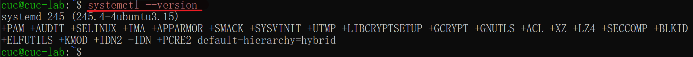

# Linux - H3
> author: OceanFish

## Homework

1. 完成<strong> `Systemd` 入门教程练习</strong>并将完整操作过程上传 asciinema， 文档上传 GitHub

2. 完成<strong>自查清单</strong>
>* 如何添加一个用户并使其具备sudo执行程序的权限？
>* 如何将一个用户添加到一个用户组？
>* 如何查看当前系统的分区表和文件系统详细信息？
>* 如何实现开机自动挂载Virtualbox的共享目录分区？
>* 基于LVM（逻辑分卷管理）的分区如何实现动态扩容和缩减容量？
>* 如何通过systemd设置实现在网络连通时运行一个指定脚本，在网络断开时运行另一个脚本？
>* 如何通过systemd设置实现一个脚本在任何情况下被杀死之后会立即重新启动？实现杀不死？

## Solve

### Systemd 入门教程：命令篇 by 阮一峰的网络日志

#### 1. 查看 Systemd 的版本

```bash
$ systemctl --version
```



#### 2. 查看启动耗时
```bash
# 查看启动耗时
$ systemd-analyze

# 查看每个服务的启动耗时
$ systemd-analyze blame

# 显示瀑布状的启动过程流
$ systemd-analyze critical-chain

# 显示指定服务的启动流
$ systemd-analyze critical-chain atd.service
```

[](https://asciinema.org/a/9e8iwpZBzfQ67vd01GoPkr3dg)

#### 3. 查看当前主机的信息

```bash
# 显示当前主机的信息
$ hostnamectl

# 设置主机名。
$ sudo hostnamectl set-hostname oceanfish
```

[](https://asciinema.org/a/LDiWloTRobSgcwBsF3xv31sL6)

#### 4. 查看本地化设置

```bash
# 查看本地化设置
$ localectl

# 设置本地化参数。
$ sudo localectl set-locale LANG=en_GB.utf8
$ sudo localectl set-keymap en_GB
```

[](https://asciinema.org/a/nRqDTUymand1Wdt5eX2bTB0C5)

#### 5. 查看当前时区设置

```bash
# 查看当前时区设置
$ timedatectl

# 显示所有可用的时区
$ timedatectl list-timezones

# 设置当前时区
$ sudo timedatectl set-timezone America/New_York

# 为了不影响系统时间准确性，下面两条不执行
$ sudo timedatectl set-time YYYY-MM-DD
$ sudo timedatectl set-time HH:MM:SS
```

[](https://asciinema.org/a/ONGrBRzklUdYC3LuYibp3GVUd)

#### 6. 查看当前登录的用户

```bash
# 列出当前session
$ loginctl list-sessions

# 列出当前登录用户
$ loginctl list-users

# 列出显示指定用户的信息
$ loginctl show-user cuc
```

[](https://asciinema.org/a/1mkWELFbhnaaM8VyDA3aCf07R)

#### 7. 查看当前系统的所有 Unit

```bash
# 列出正在运行的 Unit
$ systemctl list-units

# 列出所有Unit，包括没有找到配置文件的或者启动失败的
$ systemctl list-units --all

# 列出所有没有运行的 Unit
$ systemctl list-units --all --state=inactive

# 列出所有加载失败的 Unit
$ systemctl list-units --failed

# 列出所有正在运行的、类型为 service 的 Unit
$ systemctl list-units --type=service
```

[](https://asciinema.org/a/dKhv2bJecIpK7HRaGuTjhIStG)

#### 8. 查看系统状态和单个 Unit 的状态

```bash
# 显示系统状态
$ systemctl status

# 显示单个 Unit 的状态
$ systemctl status bluetooth.target

# 以下以 sshd.service 这个 Unit 为例
# 显示某个 Unit 是否正在运行
$ systemctl is-active sshd.service

# 显示某个 Unit 是否处于启动失败状态
$ systemctl is-failed sshd.service

# 显示某个 Unit 服务是否建立了启动链接
$ systemctl is-enabled sshd.service
```

[](https://asciinema.org/a/f3UtWTZwN3NLCwKJ5CJrKOYJP)

#### 9. 列出一个 Unit 的所有依赖

```bash
# 列出一个 Unit 的所有依赖( target 关系未展开)
$ systemctl list-dependencies sshd.service

# 列出一个 Unit 的所有依赖(包括 target 关系)
$ systemctl list-dependencies --all sshd.service
```

[](https://asciinema.org/a/Xpgdvx3eXrfwSt0ecv8gurkU4)

#### 10. 列出所有配置文件

```bash
# 列出所有配置文件
$ systemctl list-unit-files

# 列出指定类型的配置文件
$ systemctl list-unit-files --type=service
```

[](https://asciinema.org/a/Lbu0eaoRJpmKcm9N8D3nLNOU0)

#### 11. 查看配置文件的内容

```bash
$ systemctl cat atd.service
```


#### 12. Target 管理

```bash
# 查看当前系统的所有 Target
$ systemctl list-unit-files --type=target

# 查看一个 Target 包含的所有 Unit
$ systemctl list-dependencies multi-user.target

# 查看启动时的默认 Target
$ systemctl get-default

# 设置启动时的默认 Target
$ sudo systemctl set-default multi-user.target

# 切换 Target 时，默认不关闭前一个 Target 启动的进程，
# systemctl isolate 命令改变这种行为，
# 关闭前一个 Target 里面所有不属于后一个 Target 的进程
$ sudo systemctl isolate multi-user.target
```

[](https://asciinema.org/a/AStLhYJ8a8Z15iMUvmelK7s3K)

#### 13. 日志管理

```bash
# 查看所有日志（默认情况下 ，只保存本次启动的日志）
$ sudo journalctl

# 查看内核日志（不显示应用日志）
$ sudo journalctl -k

# 查看系统本次启动的日志
$ sudo journalctl -b
$ sudo journalctl -b -0

# 查看上一次启动的日志（需更改设置）
$ sudo journalctl -b -1

# 查看指定时间的日志
$ sudo journalctl --since="2022-3-20 18:17:16"
$ sudo journalctl --since "20 min ago"
$ sudo journalctl --since yesterday
$ sudo journalctl --since "2022-03-20" --until "2022-03-30 03:00"
$ sudo journalctl --since 09:00 --until "1 hour ago"

# 显示尾部的最新10行日志
$ sudo journalctl -n

# 显示尾部指定行数的日志
$ sudo journalctl -n 20

# 实时滚动显示最新日志
$ sudo journalctl -f

# 查看指定服务的日志
$ sudo journalctl /usr/lib/systemd/systemd

# 查看指定进程的日志
$ sudo journalctl _PID=1

# 查看某个路径的脚本的日志
$ sudo journalctl /usr/bin/bash

# 查看指定用户的日志
$ sudo journalctl _UID=33 --since today

    # 查看某个 Unit 的日志
    $ sudo journalctl -u sshd.service
    $ sudo journalctl -u nginx.service --since today

    # 实时滚动显示某个 Unit 的最新日志
    $ sudo journalctl -u nginx.service -f

    # 合并显示多个 Unit 的日志
    $ journalctl -u nginx.service -u php-fpm.service --since today

# 查看指定优先级（及其以上级别）的日志，共有8级
# 0: emerg
# 1: alert
# 2: crit
# 3: err
# 4: warning
# 5: notice
# 6: info
# 7: debug
$ sudo journalctl -p err -b

# 日志默认分页输出，--no-pager 改为正常的标准输出
$ sudo journalctl --no-pager

# 以 JSON 格式（单行）输出
$ sudo journalctl -b -u nginx.service -o json

# 以 JSON 格式（多行）输出，可读性更好
$ sudo journalctl -b -u nginx.serviceqq
 -o json-pretty

# 显示日志占据的硬盘空间
$ sudo journalctl --disk-usage

# 指定日志文件占据的最大空间
$ sudo journalctl --vacuum-size=1G

# 指定日志文件保存多久
$ sudo journalctl --vacuum-time=1years
```