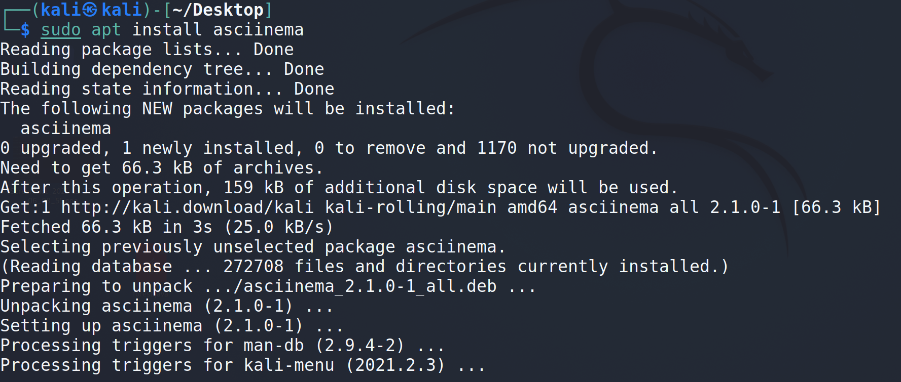
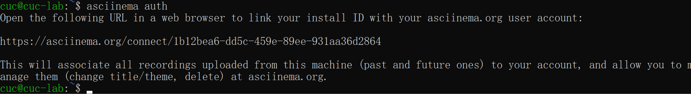
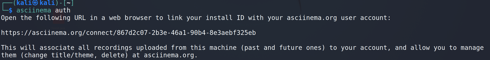
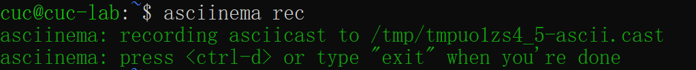

# Linux - H2
> author: 2020212063017 邱纪霖
 ---
## Homework:
使用表格方式记录至少 2 个不同 Linux 发行版本上以下信息的获取方法，使用 asciinema 录屏方式「分段」记录相关信息的获取过程和结果

* 【软件包管理】在目标发行版上安装 tmux 和 tshark ；查看这 2 个软件被安装到哪些路径；卸载 tshark ；验证 tshark 卸载结果
<br>

* 【文件管理】复制以下 shell 代码到终端运行，在目标 Linux 发行版系统中构造测试数据集，然后回答以下问题：
    * 找到 /tmp 目录及其所有子目录下，文件名包含 666 的所有文件
    * 找到 /tmp 目录及其所有子目录下，文件内容包含 666 的所有文件

```bash
cd /tmp && for i in $(seq 0 1024);do dir="test-$RANDOM";mkdir "$dir";echo "$RANDOM" > "$dir/$dir-$RANDOM";done
```
<br>

* 【文件压缩与解压缩】练习课件中 文件压缩与解压缩 一节所有提到的压缩与解压缩命令的使用方法
<br>

* 【跟练】 子进程管理实验
<br>

* 【硬件信息获取】目标系统的 CPU、内存大小、硬盘数量与硬盘容量

---

## Environment:
虚拟机环境：
* Ubuntu 20.04
* Kali 5.10.0  (Debian 5.10.28)

宿主机环境：
* Mircosoft Windows 10

---

## Solve:

#### 1.前置工具安装：
在虚拟机安装 `asciinema` 并完成绑定：
```bash
sudo apt install asciinema
```
`Ubuntu` 在看网课的时候已经安装，下图为 `kali` 安装过程：



完成绑定：
```bash
asciinema auth
```
Ubuntu:



Kali:



开始录制：
```bash
asciinema rec
```


---

#### 2.【软件包管理】

安装 `tmux` 和 `tshark`:
```bash
sudo apt search tmux
sudo apt install tmux
sudo apt search tshark
sudo apt install tshark
```

安装完成后用 `which` 和 `find` 查找文件位置:

```bash
which tmux
which tshark
sudo find / -name tmux
sudo find / -name tshark
```

卸载 `tshark`:

```bash
sudo apt-get purge tshark
```

验证卸载结果:

```bash
which tshark
sudo find / -name tshark
```
发现 `/bin` 已经被删除:

Ubuntu `asciinema` 录屏地址：
https://asciinema.org/a/8s4BCXZUkc0MFKxbpzuBC5MFp

Kali `asciinema` 录屏地址:
https://asciinema.org/a/yow1rBRPALyH0DJaTs6k9mC4Z

---

#### 【文件管理】

运行题目代码：

```bash
cd /tmp && for i in $(seq 0 1024);do dir="test-$RANDOM";mkdir "$dir";echo "$RANDOM" > "$dir/$dir-$RANDOM";done
```

查找 `/tmp` 目录及其所有子目录下，<strong>文件名</strong>包含 `666` 的所有文件:

```bash
sudo find /tmp -name "*666*"
```

查找 `/tmp` 目录及其所有子目录下，<strong>文件内容</strong>包含 `666` 的所有文件:

```bash
sudo grep -rIH "666"
```

Ubuntu `asciinema` 录屏地址:
https://asciinema.org/a/TXbHQn0d00M7TnEciuLS7aFqC

Kali `asciinema` 录屏地址:
https://asciinema.org/a/P0Jn0avURKLSUI43mNQFipp5c

---

#### 【文件压缩与解压缩】

提到的解压缩文件：
Name|Ubuntu|Kali
-|-|-
gzip|√|√
bzip2|√|√
zip| |√
tar|√|√
7z (p7zip)|√|√
rar (p7zip-rar / unrar-free)|√|√

p.s.
- [x] 为用 `dpkg --list` 查找后已完成安装的

补充安装：
```bash
sudo apt install zip
```

初始化:

```bash
vi test.txt
```

压缩与解压缩:

`gzip` compress and decompress:
```bash
gzip test # compress(default)
gzip -d text.gz # decompress
```

`bzip2` compress and decompress:
```bash
bzip2 test # compress
bzip2 -d test.bz2 # decompress
```

`zip` compress and decompress:
```bash
zip test.zip test # compress
unzip test.zip # decompress
```

`tar` compress and decompress:
```bash
tar czf test.tar.gz test # compress
rm test.txt
tar xvf test.tar.gz # decompress
```

`7z` compress and decompress:
```bash
7z a test.7z test # compress
rm test.txt
7z x test.7z # decompress
```

`rar` compress andd decompress:
```bash
rar a test.rar test # compress
rm test.txt
rar x test.rar # decompress
```

Ubuntu `asciinema` 录屏地址:
https://asciinema.org/a/BOJXmYm7AVOGlxbgdiXNJK5fM

Kali `asciinema` 录屏地址:
https://asciinema.org/a/hpqMXFCMDep3hxSNVqCPgHG2p

---

#### 【跟练】

过程:
```bash
ping www.baidu.com
```
输出过程中输入 `ifconfig` 无效， `^C` 中止
```bash
ping www.baidu.com & # 在后台执行
```
再输入 `ifconfig` 和 `uname -a` 成功输出
输入 `^C` 无效，无法退出
输入 `fg` 后再 `^C` 成功退出
```bash
ping www.baidu.com 1>/dev/null 2>&1 & # 后台将ping的结果和错误输出到/dev/null中
```
再次尝试
```bash
ifconfig
uname -a
lsb_release -a
```
成功
```bash
ps aux | grep ping # 抓取带关键词ping的进程
```
再添加一个 `ping` 进程
```bash
ping map.baidu.com 1>/dev/null 2>&1 &
ps aux | grep ping
```
用 `fg` 将第二个 `ping` 切换至前台并且 `^C` 结束
再次查看
```bash
ps aux | grep ping
```
重复该过程将第一个 `ping` 也结束并查看
重新启动
```bash
ping map.baidu.com 1>/dev/null 2>&1 &
```
用 `fg` + `^Z` 将其挂起并查看，发现其状态改变
用 `killall` 关闭线程
```bash
killall ping # 关闭所有ping进程
ps aux | grep ping
```
发现挂起的 `ping` 没被kill

```bash
pstree -A # 查看进程树
```
用 `kill + 进程号` 杀死 `ping` 失败
```bash
kill -9  ... # 强制结束
ps aux | grep ping
```
成功

Ubuntu `asciinema` 录屏地址:
https://asciinema.org/a/MKfErmCeDqkK9eG8OhT1o9pko

Kali `asciinema` 录屏地址:
https://asciinema.org/a/6kVroKhEJUu75LOuwqtWWAAWs

---

#### 【硬件信息获取】

```bash
sudo lshw
```

Ubuntu `asciinema` 录屏地址:
https://asciinema.org/a/NuVh3UPODBaRDMgbltiej7O8g

Kali `asciinema` 录屏地址:
https://asciinema.org/a/hcyX94dkFlbTKBfBFB9rh74bE

---

## 参考资料：

`asciinema` 个人空间:

https://asciinema.org/~Ocean-fish

参考资料:

https://askubuntu.com/questions/151941/how-can-you-completely-remove-a-package

https://www.runoob.com/linux/linux-comm-find.html

https://askubuntu.com/questions/127892/how-to-find-a-text-file-which-contains-a-specific-word-inside-not-in-its-name

https://askubuntu.com/questions/443830/delete-all-files-whose-filenames-contain-a-particular-string

https://askubuntu.com/questions/660846/how-to-zip-and-unzip-a-directory-and-its-files-in-linux

https://askubuntu.com/questions/31618/how-can-i-find-my-hardware-details