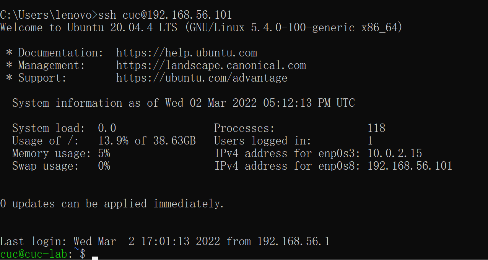

# Linux - Week1 - H1
>author: 2020212063017 邱纪霖

## Homework:
* 调查并记录实验环境的如下信息：
    * 当前 Linux 发行版基本信息
    * 当前 Linux 内核版本信息
* Virtualbox 安装完 Ubuntu 之后新添加的网卡如何实现系统开机自动启用和自动获取 IP？
* 如何使用 scp 在「虚拟机和宿主机之间」、「本机和远程 Linux 系统之间」传输文件？
* 如何配置 SSH 免密登录?

## Solve:

0.打开虚拟机，用主机的 cmd 命令行 `ssh` 指令连接


---

1.用 `lsb_release -a` 查询当前Linux发行版基本信息


---

2.用 `uname -srm` 查询当前Linux内核版本信息


---

3.
首先在虚拟机设置页面添加新的网卡 `网卡3` 在 Ubuntu 内显示为 `enp0s9`


用 `ifconfig` 和 `ifconfig -a` 分别查看工作网卡和所有网卡

工作网卡：

所有网卡：


发现新添加的 `enp0s9` 网卡未启用
用 `sudo vi /etc/netplan/00-installer-config.yaml` 打开配置文件


在其下添加新的配置：

```
enp0s9:
    dhcp4: true
```


随后保存退出文档，使用 `sudo netplan apply` 指令应用更改


重启虚拟机并重新连接，再次查看网卡工作情况，发现其自动开始工作并获取ip


---

4.
> 由于第四题是第五步的一部分，本题第一部分“传输文件至虚拟机”将以第五题的内容进行作答，即将 `/.ssh/`中的公钥文件 `id_rsa.pub` 传输进虚拟机中

4.1 用 `scp` 传输文件至虚拟机
退到 Windows 自己的 cmd 命令行界面，用 `scp` 指令传输文件：

```
scp C:\Users\lenovo\.ssh\id_rsa.pub cuc@192.168.56.101:~/.ssh
```


传输成功后连接虚拟机查看结果


4.2 用 `scp` 传输文件至远程Linux系统

利用阿里云线上云服务的环境创建远程虚拟机：


用 `scp` 传输文件 `test.txt`

```
scp C:\Users\lenovo\Desktop\test.txt root@101.133.153.138:~
```


在云端主机查看：


---

5.
提前已经用命令设置好了 ssh 公钥

```
ssh-keygen -t rsa
```

接第四题后的操作，已经将 `id_rsa.pub` 传输至虚拟机
设置 Ubuntu 公钥：
```
cat ~/.ssh/id_rsa.pub >> ~/.ssh/authorized_keys
```


设置属性：

```
sudo chmod 600 authorized_keys
sudo chmod 700 ~/.ssh
```


修改 Ubuntu 的 `/etc/ssh/sshd_config` :


重启 ssh 服务：


重新用 cmd 登录，成功实现免密登录:



---

## Problem:

1.在远程连接云端Linux的时候使用错误的用户名和ip地址导致连接不上。
##### 解决：
应使用 ESC 界面中的用户名和弹性IP

---

2.按要求设置了 ssh 免密登录后仍然无法成功免密登录
##### 解决：
ssh 免密登录原理是通过 RSA 公私密钥对自动匹配从而省去输入密码这一项。然而在之前的 GitHub 设置中我提前生成了<strong>带有密码口令</strong>的 RSA 密钥，导致实际上仍然需要密码进行登录。
我重新设置成了<strong>无密码口令</strong>的 RSA 密钥后再进行相同操作，成功实现免密登录。

## 参考资料：

1~2. www.Google.com

3.配置网卡
https://blog.csdn.net/xiongyangg/article/details/110206220

4.用scp传输文件
https://linuxize.com/post/how-to-use-scp-command-to-securely-transfer-files/

5.设置ssh免密登录
https://segmentfault.com/a/1190000040853097

https://www.leezy.top/2020/02/04/Ubuntu%E8%AE%BE%E7%BD%AESSH%E5%85%8D%E5%AF%86%E7%A0%81%E7%99%BB%E5%BD%95/