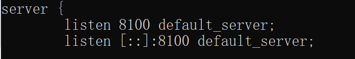
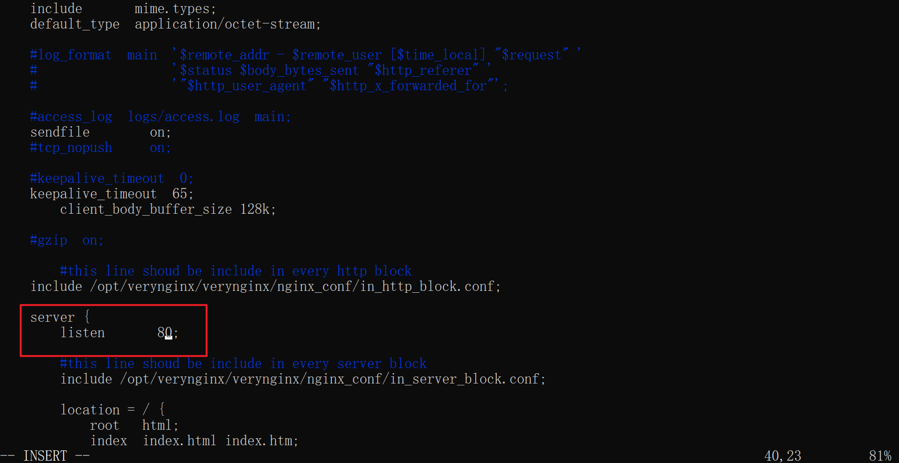
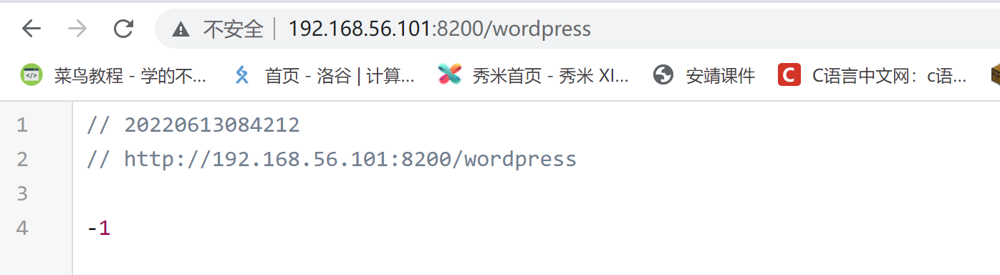
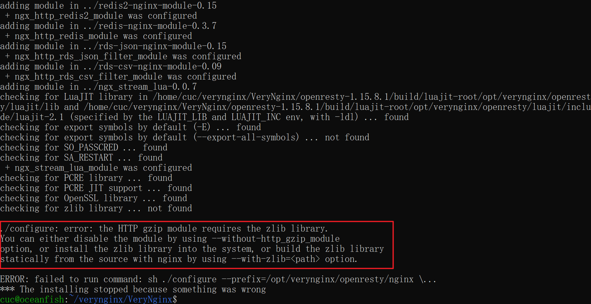
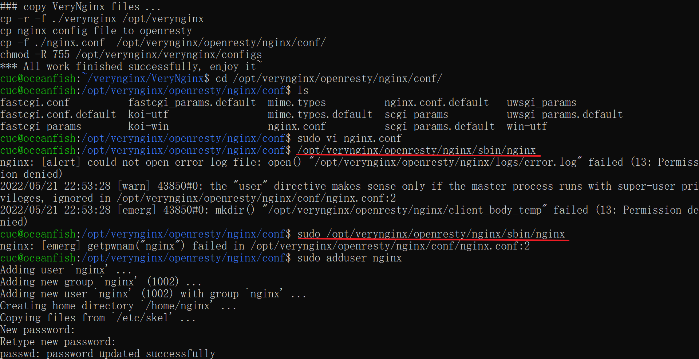

# Chap0x05
> author: oceanfish

---

## 实验环境
虚拟机：Ubuntu 20.04
宿主机：Microsoft Windows 10

---

## 实验内容
### 基本要求
* 在一台主机（虚拟机）上同时配置Nginx和VeryNginx
    * VeryNginx作为本次实验的Web App的反向代理服务器和WAF
    * PHP-FPM进程的反向代理配置在nginx服务器上，VeryNginx服务器不直接配置Web站点服务
* 使用Wordpress搭建的站点对外提供访问的地址为： http://wp.sec.cuc.edu.cn
* 使用Damn Vulnerable Web Application (DVWA)搭建的站点对外提供访问的地址为： http://dvwa.sec.cuc.edu.cn

### 安全加固要求
* 使用IP地址方式均无法访问上述任意站点，并向访客展示自定义的友好错误提示信息页面-1
* Damn Vulnerable Web Application (DVWA)只允许白名单上的访客来源IP，其他来源的IP访问均向访客展示自定义的友好错误提示信息页面-2
* 在不升级Wordpress版本的情况下，通过定制VeryNginx的访问控制策略规则，热修复WordPress < 4.7.1 - Username Enumeration
* 通过配置VeryNginx的Filter规则实现对Damn Vulnerable Web Application (DVWA)的SQL注入实验在低安全等级条件下进行防护

### VeryNginx配置要求
* VeryNginx的Web管理页面仅允许白名单上的访客来源IP，其他来源的IP访问均向访客展示自定义的友好错误提示信息页面-3
* 通过定制VeryNginx的访问控制策略规则实现：
    * 限制DVWA站点的单IP访问速率为每秒请求数 < 50
    * 限制Wordpress站点的单IP访问速率为每秒请求数 < 20
    * 超过访问频率限制的请求直接返回自定义错误提示信息页-4
    * 禁止curl访问

---

## 实验流程

### 1.准备工作
#### 在虚拟机上安装 `nginx`

```bash
sudo apt update
sudo apt install nginx
```

系统提示：
```
...
Not attempting to start NGINX, port 80 is already in use.
...
```

配置 `nginx` 端口：
```bash
cd /etc/nginx/sites-enabled
sudo vi default
```


修改后：


启动 `nginx`:

```bash
sudo systemctl start nginx
sudo systemctl status nginx
```


连接 `192.168.56.101:8100`：


#### 在虚拟机上安装 `verynginx`
```bash
# 准备工作
mkdir verynginx
cd verynginx
git clone git@github.com:alexazhou/VeryNginx.git
cd VeryNginx
sudo apt install python
sudo apt install libssl-dev
sudo apt install libpcre3-dev

# 安装
sudo python install.py install # 需要 sudo 不然会报 permission deny
```
安装成功：


配置 `verynginx` 的端口：
```bash
cd /opt/verynginx/openresty/nginx/conf
sudo vi nginx.conf
```


修改后：


启动 `verynginx`：
```bash
sudo /opt/verynginx/openresty/nginx/sbin/nginx
```

连接 `192.168.56.101:8200/verynginx/index.html`：


#### 配置宿主机 `host`
在 `C:/System32/drivers/etc` 中找到 `host` 文件
添加
```
# 测试网址
192.168.56.101 mynginx www.oceanfishnginx.com

# 目标搭建网址
192.168.56.101 wp.sec.cuc.edu.cn dvwa.sec.cuc.edu.cn
```

### 2.配置及搭建
#### 配置 `nginx`
创建服务器根目录 `mynginx`:
```bash
mkdir mynginx
```
创建 `index.html` 主页面:
```bash
cd mynginx
vi index.html
# 以下内容在 index 中
<html>
<body>
    <h1>Hello Nginx</h1>
</body>
#
```
配置 `root` 和 `server_name`:
```
root /home/cuc/mynginx;
server_name mynginx;
```


连接 `mynginx:8100`:


配置 `php-fpm` 反向代理服务器:
下载 `php-fpm`
```bash
sudo apt install php-fpm
```
配置 `php-fpm`:
```bash
cd /etc/php/7.4/fpm/pool.d/
sudo vi www.comf
```
将端口号改为 `127.0.0.1：9000`:


在 `~/mynginx/php` 中创建 `index.php`:
```php
<?php
phpinfo();
?>
```

在 `/etc/nginx/conf.d/` 中创建新的 `mynginx.conf`
```
server{
        listen 192.168.56.101:8100;
        server_name www.oceanfishnginx.com;

        root /home/cuc/mynginx/;

        location / {
                index index.html;
        }

        location ~ \.php$ {
                root /home/cuc/mynginx/php/;
                include /etc/nginx/fastcgi.conf;
                fastcgi_intercept_errors on;
                fastcgi_index index.php;
                fastcgi_param SCRIPT_FILENAME $document_root$fastcgi_script_name;
                include fastcgi_params;
                fastcgi_pass 127.0.0.1:9000;
        }
}
```

重启 `php-fpm` 和 `nginx`
连接 `www.oceanfishnginx.com:8100/index.php`


#### 在 `nginx` 上搭建 `Wordpress 4.7`
用 `scp` 将 `wordpress4.7-zip` 传输至虚拟机并解压缩
```bash
# 宿主机
scp wordpress-4.7.zip cuc@192.168.56.101:~/mynginx/wordpress

# 虚拟机 ~/mynginx/
unzip wordpress-4.7.zip
```
接着在 `nginx` 中配置虚拟主机:
```bash
cd /etc/nginx/conf.d/
sudo vi wordpress.conf

# in file
server{
        listen 192.168.56.101:8100;
        server_name wp.sec.cuc.edu.cn;

        root /home/cuc/mynginx/wordpress/;

        location / {
                index index.html;
        }

        location ~ \.php$ {
                root /home/cuc/mynginx/wordpress/;
                include /etc/nginx/fastcgi.conf;
                fastcgi_intercept_errors on;
                fastcgi_index index.php;
                fastcgi_param SCRIPT_FILENAME $document_root$fastcgi_script_name;
                include fastcgi_params;
                fastcgi_pass 127.0.0.1:9000;
        }

}

# 重新载入配置
sudo nginx -t
sudo nginx -s reload
```
按照 `readme.html` 中的步骤进行安装
对数据库进行配置
```sql
create database wordpress;

create user wordpress@localhost identified by 'wordpress';

grant all on wordpress.* to wordpress@localhost;

flush privileges;
```
安装


安装完成登录连接：


#### 在 `nginx` 上搭建 `DVWA`
```bash
# 虚拟机
mkdir dvwa/
cd dvwa/

# 宿主机下载好 DVWA-master.zip
scp DVWA-master.zip cuc@192.168.56.101:~/mynginx/dvwa

# 虚拟机
unzip DVWA-master.zip
```

配置 `DVWA`
```bash
cd /etc/nginx/conf.d/
sudo vi dvwa.conf

# in file
server{
        listen 192.168.56.101:8100;
        server_name dvwa.sec.cuc.edu.cn;

        root /home/cuc/mynginx/dvwa/DVWA-master;

        location / {
                index index.html;
        }

        location ~ \.php$ {
                root /home/cuc/mynginx/dvwa/DVWA-master;
                include /etc/nginx/fastcgi.conf;
                fastcgi_intercept_errors on;
                fastcgi_index index.php;
                fastcgi_param SCRIPT_FILENAME $document_root$fastcgi_script_name;
                include fastcgi_params;
                fastcgi_pass 127.0.0.1:9000;
        }
}

# 重新载入配置
sudo nginx -t
sudo nginx -s reload
```

按照文件中 `README.md` 进行安装
```bash
# 重命名配置文件
cd config/
cp config.inc.php.dist config.inc.php

# 安装依赖
apt-get -y install apache2 mariadb-server php php-mysqli php-gd libapache2-mod-php

# 配置数据库
mysql> create database dvwa;
Query OK, 1 row affected (0.00 sec)

mysql> create user dvwa@localhost identified by 'p@ssw0rd';
Query OK, 0 rows affected (0.01 sec)

mysql> grant all on dvwa.* to dvwa@localhost;
Query OK, 0 rows affected (0.01 sec)

mysql> flush privileges;
Query OK, 0 rows affected (0.00 sec)
```
链接 `dvwa.sec.cuc.edu.cn:8100/login.php` 进行登录


#### 配置 `verynginx` 作为 waf


### 2.配置安全加固要求
1. 使用IP地址方式均无法访问上述任意站点，并向访客展示自定义的友好错误提示信息页面-1


测试


2. Damn Vulnerable Web Application (DVWA)只允许白名单上的访客来源IP，其他来源的IP访问均向访客展示自定义的友好错误提示信息页面-2


测试


3. 在不升级Wordpress版本的情况下，通过定制VeryNginx的访问控制策略规则，热修复WordPress < 4.7.1 - Username Enumeration

4. 通过配置VeryNginx的Filter规则实现对Damn Vulnerable Web Application (DVWA)的SQL注入实验在低安全等级条件下进行防护

设置低安全等级

设置过滤拦截


### Verynginx 配置要求

1. VeryNginx的Web管理页面仅允许白名单上的访客来源IP，其他来源的IP访问均向访客展示自定义的友好错误提示信息页面-3


测试


2. 限制DVWA站点的单IP访问速率为每秒请求数 < 50
3. 限制Wordpress站点的单IP访问速率为每秒请求数 < 20
4. 超过访问频率限制的请求直接返回自定义错误提示信息页面-4


5. 禁止curl访问


测试


---
## 遇到的问题及解决
1.
安装 `verynginx` 时报错：


解决：
```bash
sudo apt search zlib
sudo apt install zlib1g-dev
```

2.
启动 `verynginx` 时报错：


解决：
```bash
sudo adduser nginx # 添加 nginx 用户
sudo /opt/verynginx/openresty/nginx/sbin/nginx # 用 sudo 启动 verynginx
```

3.
安装 `DVWA` 时报错：


解决：
将 `config/config.inc.php.dist` 复制一份变成 `config.inc.php`

4.
以域名对 `nginx` 进行配置时，宿主机无法通过域名访问
配置 `nginx.conf`
```
...
listen 8100;

server_name www.oceanfishnginx.com;
...
```
配置宿主机 `hosts`
```
192.168.56.101 www.oceanfishnginx.com
```
在浏览器中访问 `www.oceanfishnginx.com:8100` 时失败


解决：
关闭网络代理

4.
搭建完 `wordpress` 后进行登录显示 403


解决：
将 `index.php` 添加至 `nginx` 的配置文件的 `index` 中
```
index index.php;
```

---

## 参考资料
[nignx 官网](https://www.nginx.com/resources/wiki/)
[修改 nignx 端口配置](https://segmentfault.com/a/1190000021294053)
[nginx 配置](https://blog.martinfjordvald.com/nginx-primer/)
[verynignx 官方 wiki](https://github.com/alexazhou/VeryNginx/blob/master/readme_zh.md)

参考作业：
[2022-linux-public-dangyuyan](https://github.com/CUCCS/2022-linux-public-dangyuyan/blob/chap0x05/chap0x05/chap0x05.md)